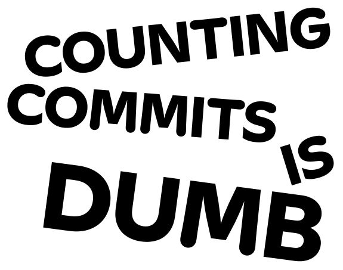

A lot of sites rank developers just by the number of commits, but that’s pretty dumb.

More commits don’t mean you’re a better dev. Just having a high commit count isn’t an accomplishment on its own.  

        

        

